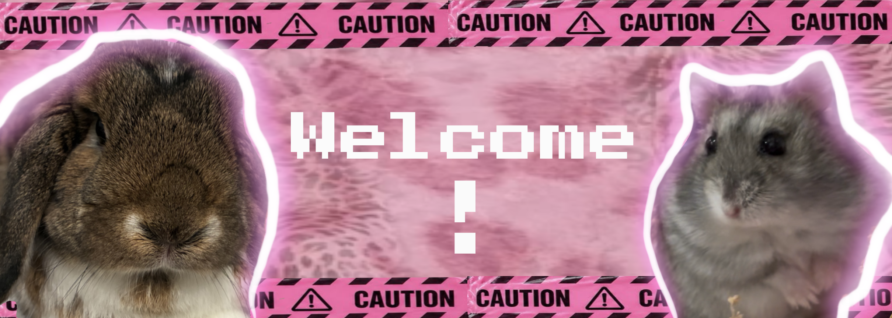

# Sia's Prototype Projects 

# Description

Greetings and welcome to my website! This is where you'll see a collection of my prototyping projects throughout this course. It will show off all of my new ideas, expirements and creative coding projects. My goals by the end of the year is to have a decent understanding of this medium and use my knowledge to create video games or websites. As the months go by, you will be able to follow my journey and see my improvments as I learn programming with zero prior experience. I am extremely eager and excited to learn coding as it will be a new way to express myself through creative fun projects!

# Journal and Resources

# Prototype Projects 

